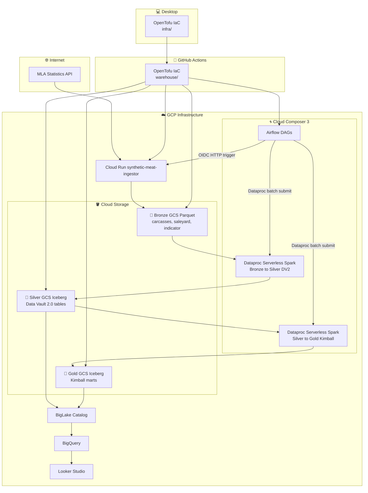

# Meat Distribution Data Platform (Learning Project)

A small data platform built on Google Cloud to explore modern lakehouse tooling, infrastructure as code, and CI/CD for data pipelines.

This repository accompanies the article [**“Cheap to run, expensive to change”**](https://boneleve.blog/posts/2026-03-04-cost-of-change).

The project began as an attempt to build a **cheap, realistic data platform** for a meat distribution business. It succeeded technically, but it also exposed something more important: how easily the **cost of change hides inside well-intentioned best practices**.

The repository remains available as a **learning artifact** illustrating both the implementation and the architectural trade-offs described in the article.

---

## Architecture Overview

The platform follows a typical lakehouse pipeline:



Key orchestration and infrastructure components:

- **Apache Airflow (Cloud Composer 3)** for orchestration
- **Dataproc Serverless Spark** for batch transformations
- **Google Cloud Storage** for Bronze and Silver layers
- **BigQuery / BigLake** for analytics access
- **DataPlex** for catalog and governance
- **OpenTofu (Terraform)** for infrastructure provisioning
- **GitHub Actions** for CI/CD

A synthetic data generator simulates carcass-level events derived from public livestock statistics so that traceability can be modelled realistically.

---

## Architecture Decisions

Some design choices in this project were deliberate learning trade-offs:

- **Synthetic carcass generation** allowed realistic traceability modelling but introduced coupling between ingestion and modelling.
- **Cloud Composer (Airflow)** provided familiar orchestration patterns but slowed the local feedback loop.
- **Separate infrastructure roots (`infra/` and `warehouse/`)** mirrored common organisational structures but added operational indirection.

These decisions are explored in detail in the accompanying article:

This repository accompanies the article [**“Cheap to run, expensive to change”**](https://boneleve.blog/posts/2026-03-04-cost-of-change).

---

## Repository Structure

```
repo-root/
├── .github/workflows/        # CI/CD pipelines
│   ├── deploy.yml
│   ├── dag.yml
│   └── ingestion.yml
├── dag/                      # Airflow DAGs and Spark jobs
├── infra/                    # Base infrastructure and IAM configuration
├── ingestion/                # Cloud Run ingestion service
│   └── synthetic-meat/
├── warehouse/                # Data platform infrastructure
├── docs/                     # Architecture and development notes
├── scripts/                  # Utility scripts
└── README.md
```

The infrastructure is split across two OpenTofu roots:

- **infra/** – foundational CI/CD permissions and Workload Identity
- **warehouse/** – the data platform resources themselves

This separation mirrors common organisational practices but also introduces some of the operational friction discussed in the article.

---

## Deployment Model

The project uses a two-stage deployment strategy.

### Core infrastructure (`infra/`)

Creates foundational components such as:

- Workload Identity Federation
- deployment service account
- project IAM permissions

Because these permissions are sensitive, this configuration is intended to be applied manually from a local machine.

```bash
cd infra
tofu apply -var-file="prod.tfvars"
```

### Warehouse infrastructure (`warehouse/`)

Defines the data platform itself:

- GCS buckets
- DataPlex lake and zones
- BigQuery datasets
- orchestration resources

This configuration is deployed automatically through the GitHub Actions workflow when changes are pushed to the `warehouse/` directory.

---

## Data Flow

### Ingestion

A Cloud Run service generates synthetic carcass records derived from public livestock statistics and writes partitioned Parquet files to the Bronze layer.

Triggering:

Airflow DAG (`daily_synthetic_ingestion`) → authenticated HTTP request → Cloud Run ingestion service

### Transformation

Dataproc Serverless Spark jobs perform:

- Bronze → Silver transformations using **Data Vault 2.0 modelling**
- Silver → Gold transformations into **Kimball-style marts**

### Analytics

Gold layer tables are queried through BigQuery and visualised using Looker Studio dashboards.

---

## CI/CD and Testing

GitHub Actions pipelines perform:

- unit tests for DAG logic (`dag.yml`)
- unit tests for ingestion logic
- Docker image builds for the ingestion service (when required)
- OpenTofu plan/apply for `warehouse/` on merge to `main` (`deploy.yml`)
- DAG sync to Composer and Spark job sync to the deps bucket (`dag.yml`)

`infra/` is intended for manual bootstrap/apply. `warehouse/` is applied through CI/CD.

---

## What This Project Demonstrates

Technically, the platform demonstrates:

- Lakehouse architectures using open table formats
- Data Vault and Kimball modelling approaches
- Infrastructure as Code using OpenTofu
- CI/CD pipelines for data infrastructure
- Serverless and managed compute services on GCP

More importantly, the project illustrates the architectural lesson discussed in the accompanying article:

> **A system can be cheap to run and expensive to change.**

---

## Further Reading

The architectural reflection behind this project is documented in [**“Cheap to run, expensive to change”**](https://boneleve.blog/posts/2026-03-04-cost-of-change).

---

## Note

This repository is not presented as a polished production platform.
It is a **learning artifact** whose structure, trade-offs, and friction points are described openly in the accompanying article.

Some infrastructure blocks may be temporarily commented during development to avoid cloud costs; this does not change the intended architecture described above.
