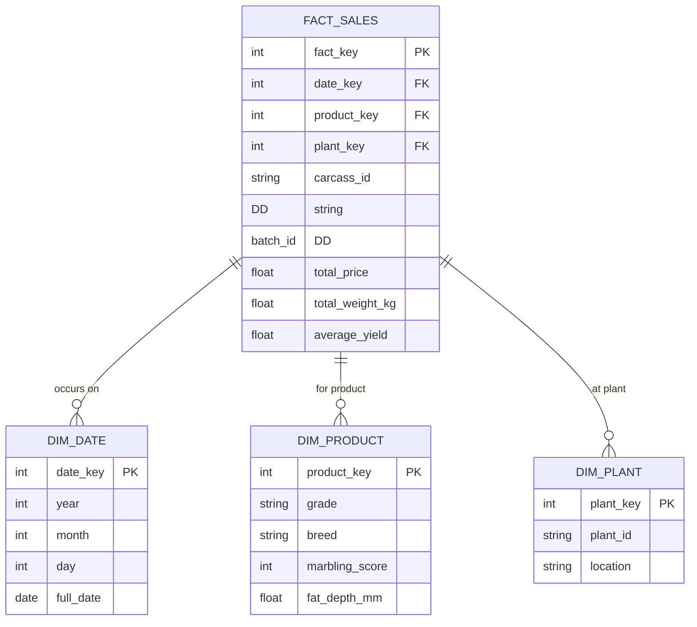

# Lakehouse Data Model for Meat Distribution Platform

This document outlines the data model for the Modern Open Lakehouse
Portfolio Project on Google Cloud, focusing on a meat distribution
platform. It covers the bronze, silver, and gold layers,
incorporating Data Vault 2.0 (DV2.0) for the silver layer and Kimball
star schema for the gold layer. The model supports traceability, catch
weight pricing, and analytics for meat processing  data.

## Business Context
The meat distribution platform simulates a supply chain for meat
products, from carcass processing to sales. Key business needs
include:

- **Traceability**: Track individual carcasses from slaughter to sale,
  including processing plant, batch, and quality attributes. This
  enables recall management (e.g., tracing back from a sale or batch
  to the specific carcass, plant, and day).

- **Catch Weight Pricing**: Prices are calculated based on actual
  weights and grades, with premiums/discounts for factors like
  marbling, fat depth, and yield. This requires flexible pricing
  models and aggregation for analytics.

- **Analytics and BI**: Provide insights into weight distributions,
  price trends, yield analysisby plant, and performance
  metrics. Dashboards in Looker Studio will visualize these for
  stakeholders.

Interview talking points:

- "How does this model ensure end-to-end traceability in a distributed
  supply chain?"

- "Explain how catch weight pricing is handled in the data model, from
  raw carcass data to aggregated sales facts."

- "What are the benefits of using Data Vault 2.0 for historical
  auditing versus traditional star schemas?"

- "How does the lakehouse architecture (bronze Parquet, silver
  Iceberg, gold BigQuery) support cost-effective, serverless data
  processing?"

## Bronze Layer

The bronze layer stores raw, immutable data ingested from the
synthetic meat processing data generator.

- **Format**: Parquet files in Google Cloud Storage (GCS) bucket
  `${project_id}-bronze`.
- **Partitioning**: `plant_id/year/month/day/batch_id.parquet` (e.g.,
`gs://bronze/carcasses/plant_id=P01/year=2025/month=12/day=27/batch_12345.parquet`).
- **Schema**: Raw JSON/Parquet with fields like:
  - `carcass_id` (string, RFID-style tag for traceability).
  - `plant_id` (string, processing plant identifier).
  - `slaughter_date` (date).
  - `weight_kg` (float, hot standard carcass weight).
  - `grade` (string, e.g., MSA, AUS-MEAT grades).
  - `price_per_kg` (float, calculated based on grid formulas).
  - `marbling_score` (int), `fat_depth_mm` (float), `yield_percentage` (float).
  - `batch_id` (string), `breed` (string), `quality_scores` (map/struct).
- **Ingestion**: Cloud Run service generates and writes batches daily
  via Cloud Scheduler.
- **Discovery**: DataPlex auto-discovers files for querying via BigLake.

## Silver Layer (Data Vault 2.0 with Iceberg)

The silver layer transforms bronze data into a Data Vault 2.0 model
for historical auditing, scalability, and flexibility. Tables are
stored as Iceberg in GCS bucket `${project_id}-silver`, partitioned by
load date or business keys.

- **Catalog**: BigLakeCatalog integrated with DataPlex.
- **Transformations**: Dataproc Serverless PySpark batches read bronze
  Parquet and write Iceberg tables.
- **Entities**:
  - **Hub_Carcass**: Core business entity for carcasses.
    - Business Key: `carcass_id` (string).
    - Load Date: `load_date` (timestamp).

  - **Hub_Processor**: Core business entity for processing plants.

    - Business Key: `plant_id` (string).
    - Load Date: `load_date` (timestamp).

  - **Sat_Carcass_Details**: Satellite for carcass attributes.

    - Links to Hub_Carcass via `carcass_hash_key`.

    - Attributes: `weight_kg`, `grade`, `marbling_score`,
      `fat_depth_mm`, `yield_percentage`, `breed`, `quality_scores`.

    - Load Date: `load_date` (timestamp).

  - **Link_Carcass_Processing**: Link table for carcass-processing relationships.

    - Links Hub_Carcass (`carcass_hash_key`) and Hub_Processor (`processor_hash_key`).

    - Attributes: `slaughter_date`, `batch_id`, `price_per_kg`.

    - Load Date: `load_date` (timestamp).

This model supports traceability by linking carcasses to processing events and allows for easy  addition of new satellites (e.g., for sales data in future phases).

### Silver Layer ERD (Data Vault 2.0)

```mermaid
erDiagram

 HUB_CARCASS ||--o{ SAT_CARCASS_DETAILS : "describes"

 HUB_PROCESSOR ||--o{ LINK_CARCASS_PROCESSING : "processes"

 HUB_CARCASS ||--o{ LINK_CARCASS_PROCESSING : "is processed by"

 HUB_CARCASS {
  string carcass_hash_key PK
  string carcass_id BK
  timestamp load_date
 }

 HUB_PROCESSOR {
  string processor_hash_key PK
  string plant_id BK
  timestamp load_date
 }

 SAT_CARCASS_DETAILS {
  string carcass_hash_key FK
  timestamp load_date PK
  float weight_kg
  string grade
  int marbling_score
  float fat_depth_mm
  float yield_percentage
  string breed
  map quality_scores
 }

 LINK_CARCASS_PROCESSING {
  string link_hash_key PK
  string carcass_hash_key FK
  string processor_hash_key FK
  timestamp load_date
  date slaughter_date
  string batch_id
  float price_per_kg
 }
```

## Gold Layer (Kimball Star Schema)

The gold layer provides a Kimball star schema for BI and analytics, materialized as BigQuery
 native tables or views in dataset `gold_meat_market`. It aggregates silver data for efficient
 querying.

- **Dimensions**:
  - **dim_date**: Date dimension (year, month, day, etc.).
  - **dim_product**: Product dimension (grade, breed, quality attributes).
  - **dim_plant**: Plant dimension (plant_id, location).

- **Fact Table**:
  - **fact_sales**: Sales facts (price, weight, yield; aggregated per
    carcass/processing event).+
    - Measures: `total_price`, `total_weight_kg`, `average_yield`.

    - Degenerate Dimensions: `carcass_id`, `batch_id`.

This schema supports queries like weight distributions, price trends,
and plant performance.

### Gold Layer ERD (Kimball Star Schema)



## Sample Queries for Looker Demo

These queries demonstrate traceability and analytics, recalling from sale/batch to
  carcass/plant/day.

- **Trace Carcasses in a Batch**:
  ```sql
  SELECT fs.carcass_id, fs.batch_id, dp.plant_id, dd.full_date, fs.total_weight_kg,
 fs.total_price
  FROM gold_meat_market.fact_sales fs
  JOIN gold_meat_market.dim_plant dp ON fs.plant_key = dp.plant_key
  JOIN gold_meat_market.dim_date dd ON fs.date_key = dd.date_key
  WHERE fs.batch_id = 'batch_12345';
  ```

- **Average Price per kg by Plant and Grade**:
  ```sql
  SELECT dp.plant_id, dprod.grade, AVG(fs.total_price / fs.total_weight_kg) AS avg_price_per_kg +  FROM gold_meat_market.fact_sales fs
  JOIN gold_meat_market.dim_plant dp ON fs.plant_key = dp.plant_key
  JOIN gold_meat_market.dim_product dprod ON fs.product_key = dprod.product_key
  GROUP BY dp.plant_id, dprod.grade;
  ```

- **Yield Analysis by Plant**:
  ```sql
  SELECT dp.plant_id, AVG(fs.average_yield) AS avg_yield
  FROM gold_meat_market.fact_sales fs
  JOIN gold_meat_market.dim_plant dp ON fs.plant_key = dp.plant_key
  GROUP BY dp.plant_id;
  ```

These queries align with Looker Studio dashboards for public demos.
